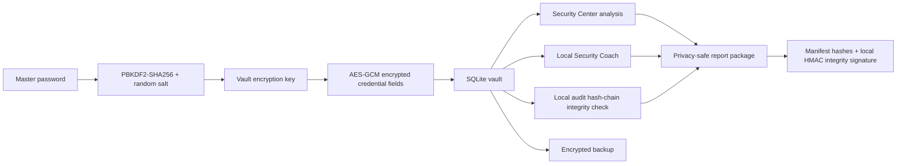

# CyberVault X Threat Model

## Scope

CyberVault X protects a local password vault on a user-controlled machine. It is designed for academic demonstration and local-first security workflows.

## Assets

- Master password
- Derived vault key
- Encrypted credential fields
- SQLite vault file
- Activity/audit log
- Encrypted backup files
- Privacy-safe report packages

## High-Level Flow

## Main Threats and Controls

| Threat | Control | Limitation |
|---|---|---|
| Stolen database file | AES-GCM encrypted sensitive fields | Master password strength still matters |
| Ciphertext swapping | AAD binds ciphertext to credential/field context | Legacy rows require migration |
| Weak/reused passwords | Local strength and reuse analysis | User must apply recommendations |
| Report leakage | Privacy-safe redaction modes | Screenshots must also be reviewed manually |
| Backup corruption | Restore preview and rollback | Backup passphrase must be protected |
| Local log editing | Audit hash-chain verification | Privileged attacker can recompute chain |
| Runtime memory inspection | Auto-lock and clipboard timeout | Python cannot securely zeroize all strings |

## Out of Scope

- Cloud synchronization security
- Browser extension security
- Hardware-backed key storage
- Certified password-manager audit
- Protection against fully compromised operating systems

## Explicit Non-Goals and User Warnings

CyberVault X is local-first security software, not a certified commercial password manager. It helps protect against a stolen vault database file, accidental report leakage, weak password hygiene, and unsafe backup/report workflows. It does not protect against malware, keyloggers, hostile screen-recording tools, memory scraping, clipboard monitors, shoulder surfing, or a fully compromised operating system.

## Local Security Coach Limits

The Local Security Coach is deterministic and evidence-bound. It uses local password analysis, reuse counts, credential age, metadata quality, offline breach-subset checks, and site-policy heuristics. It is not an external LLM, does not make cloud AI calls, and its confidence values are heuristic policy confidence rather than calibrated model accuracy.

## Backup and Export Risks

Encrypted backups still depend on a strong backup passphrase. Full/private reports can intentionally include owner, title, username, and domain identifiers, so privacy-safe minimal or standard reports should be used for sharing. Synthetic demo data is isolated in an explicit demo data package and presentation mode must not silently mutate a real user vault.
